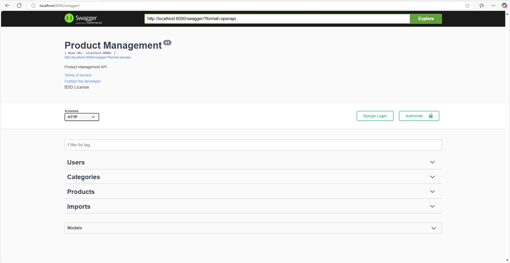

# Scalable Product Management API

## Run Locally  
1. clone this repo.
2. Go to Project Directory in terminal. 
3. Create .env with following values
````
DATABASE_USER=xxx
DATABASE_PASSWORD=xxxx
DATABASE_HOST=localhost
DATABASE_NAME=product_management
DATABASE_PORT=5432
REDIS_URL=redis_url(ex. redis://localhost:6379/0)
FROM_MAIL=your_email@example.com
MAIL_PWD=your_email_password
SIGNING_SECRET_KEY=xxx (used in login token)
````
4. Activate virtual environment  by typing below function.
````
pipenv shell
````
5. Install dependency list.
````
pip install -r requiremenets.txt
````
Here we are using celery, redis celery-beat for eunning reply nalysis task asynchronously.
6. create a superuser
````
python manage.py createsuperuser
````
7. How to install and run redis please refere: [celery-redis-django](https://www.codingforentrepreneurs.com/blog/celery-redis-django)

8. After install  and run redis please type following 2 command in 2 seperate terminal.
````
celery -A spma worker -l info -P gevent
````
9. Now run this project with.
````
python manage.py runserver
````

## Run in Docker
---
1. clone this repo.
2. Go to Project Directory in terminal.
3. Run following command.
````
docker-compose up -d
````
[API SWAGGER](http://localhost:8000/swagger)
---
